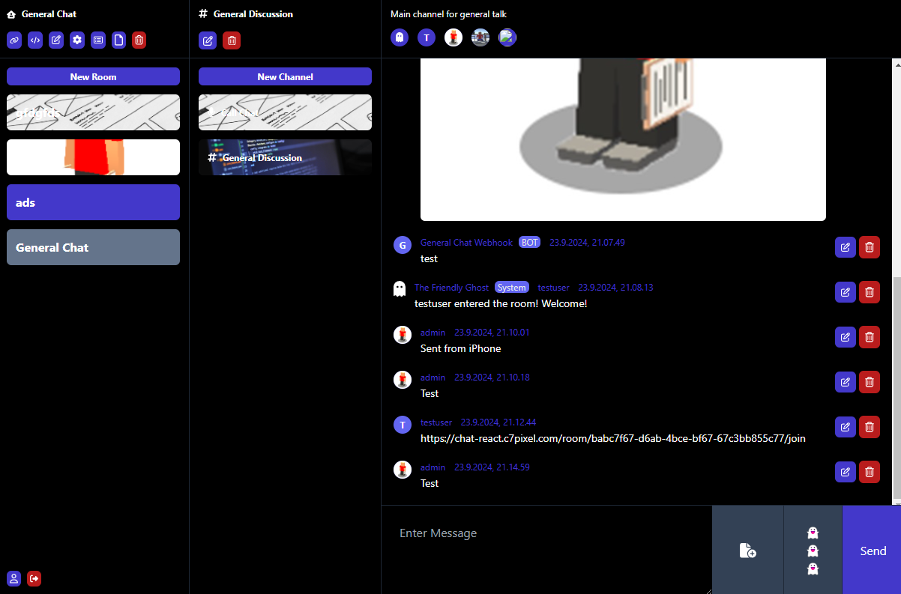

# Chat App Vue+TypeScript
A Vue.js SPA made for the chat backend application found at https://github.com/niiicolai/chat-app.



## Features
- Mobile
    - Responsive [ ]
- CSS Styles
    - Tailwind CSS [x]
- User
    - Login [x]
    - Registration [x]
    - Logout [x]
    - Edit Profile [x]
    - Delete Avatar [x]
    - Google Registration+Login [ ]
- Room
    - Create [x]
    - Update [x]
    - Delete [x]
    - List [x]
    - Select [x]
    - Leave [x]
    - EditSettings [x]
    - Delete Avatar [x]
    - Total File Usage Overview [x]
    - Channel Usage Overview [x]
    - Room User Usage Overview [x]
    - File Retention Overview [x]
    - Message Retention Overview [x]
    - Display Rules Text [x]
    - Pagination [ ]
- Room Invite Link
    - Create [x]
    - Update [x]
    - Delete [x]
    - List [x]
    - Join [x]
    - Pagination [ ]
- Room Files
    - List [x]
    - Delete [x]
    - Pagination [ ]
- Room Users
    - Set to Admin [x]
    - Set to Moderator [x]
    - Set to Member [x]
    - Kick [x]
    - Client Role Check [x]
    - Pagination [ ]
- Channel
    - Create [x]
    - Update [x]
    - Delete [x]
    - List [x]
    - Delete Avatar [x]
    - Pagination [ ]
- Channel Webhook
    - Create [x]
    - Update [x]
    - Delete [x]
    - List [x]
    - Send Test Message [x]
    - Delete Avatar [x]
    - Pagination [ ]
- Channel Message
    - Create [x]
    - Update [x]
    - Delete [x]
    - List [x]
    - Add File [x]
    - Delete File [x]
    - Scroll To Bottom Event [x]
    - Infinite Scroll [ ]
- Toast
    - Create [x]
    - List [x]
    - Delete [x]
- Websocket
    - Connect [x]
    - Join Channel [x]
    - Handle Message Events [x]
- Logging
    - Exceptions [ ]
- Testing
    - end2end tests [ ]
- Routing
    - Vue Router [x]
    - Sitemap [ ]
- CI/CD
    - GitHub Actions [x]
    - GitHub Secrets [x]
- Deployment
    - DigitalOcean [x]


## Development Environment Setup
The following are the steps to set up the development environment for the chat client.

### Install
```
npm install
cp .env.example .env
```

### Run
```
npm run dev
```

### Test 
```
npm test
```

### Run Headed Component Tests with [Cypress Component Testing](https://on.cypress.io/component)

```sh
npm run test:unit:dev # or `npm run test:unit` for headless testing
```

### Run End-to-End Tests with [Cypress](https://www.cypress.io/)

```sh
npm run test:e2e:dev
```